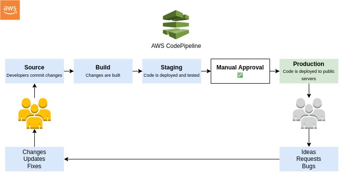
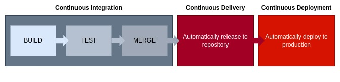

# AWS CodePipeline

**[AWS CodePipeline](https://aws.amazon.com/codepipeline/)** is a fully managed continuous delivery service that helps you automate your release pipelines for fast and reliable application and infrastructure updates. CodePipeline automates the build, test, and deploy phases of  your release process every time there is a code change, based on the release model you define. You can easily integrate AWS CodePipeline with third-party services such as Github or with your own custom plugin. With AWS CodePipeline, you only pay for what you use.

## Key CodePipeline Concepts
#### Pipelines
* A workflow that describes how software changes go through the release process.

#### Artifacts
* Files or changes that will be worked on by the actions and stages in the pipeline.
* Each pipeline stage can create *artifacts*.
* Artifacts are passed, stored in Amazon S3, and then passed on to the next stage.

#### Stages
* Pipelines are broken up into stges, e.g., build stage, deployment stage.
* Each stage can have sequential actions and or parallel actions.
* Stage examples would be build, test, deploy, load test, etc.
* Manual approval can be defined at any stage.

#### Actions
* Stages contain at least one action, these actions take some action on artifacts and will have artifacts as either an input, and output, or both.

### Transitions
* The progressing from one stage to another inside of a pipeline.

## CI/CD
**CI/CD** is a method to frequently deliver apps to customers by introducing automation into the stages of app development. The main conecpts attributed to CI/CD are continuous integration, continuous delivery, and continuous deployment. CI/CD is a solution to the problems integrating new code can cause for development and operations teams (AKA "integration hell").

CI/CD falls under DevOPS (the joining od development and operations) and combines the practices of continuous integration and continuous delivery. CI/CD automates much or all of the manual human intervention traditionally needed to get new code from a commit into production such as build, test, and deploy, as well as infrastructure provisioning.

## Continuous Integration (CI)
Continuous integration (CI) is the practice of integrating all your code changes into the main branch of a shared source code repository early and often, automatically testing each change when you commit or merge them, and automatically kicking off a build. With continuous integration, errors and security issues can be identified and fixed more easily, and much earlier in the software development lifecycle.

Continuous integration (CI) helps developers merge their code changes back to a shared branch, or “trunk,” more frequently—sometimes even daily. Once a developer’s changes to an application are merged, those changes are validated by automatically building the application and running different levels of automated testing, typically unit and integration tests, to ensure the changes haven’t broken the app. This means testing everything from classes and function to the different modules that comprise the entire app. If automated testing discovers a conflict between new and existing code, CI makes it easier to fix those bugs quickly and often.

CI workflows vary a lot depending on tools, programming language, proejct and many other factos but a common flow has these steps.
* Pushing to the code repository
* Static analysis
* Pre-deployment testing
* Packaging and deployment to the test environment
* Post-deployment testing

## Continuous Delivery (CD)
Continuous delivery (CD) is a software development practice that works in conjunction with continuous integration to automate the infrastructure provisioning and application release process. In order to have an effective continuous delivery process, it’s important that CI is already built into your development pipeline. The goal of continuous delivery is to have a codebase that is always ready for deployment to a production environment.

In continuous delivery, every stage—from the merger of code changes to the delivery of production-ready builds—involves test automation and code release automation. At the end of that process, the operations team is able to deploy an app to production quickly and easily.

## Continuous Deployment (CD)
Continuous deployment automates releasing an app to production. Because there is no manual gate at the stage of the pipeline before production, continuous deployment relies heavily on well-designed test automation. With continuous deployment, DevOps teams set the criteria for code releases ahead of time and when those criteria are met and validated, the code is deployed into the production environment.

## Reference
* [What is CI/CD?](https://www.redhat.com/en/topics/devops/what-is-ci-cd)
* [What is CI/CD?](https://about.gitlab.com/topics/ci-cd/)
* [AWS Developer Tools](https://digitalcloud.training/aws-developer-tools/)
* [What is the AWS CodePipeline?](https://www.educative.io/answers/what-is-the-aws-codepipeline)
* [Continuous Integration: A "Typical" Process](https://developers.redhat.com/blog/2017/09/06/continuous-integration-a-typical-process)