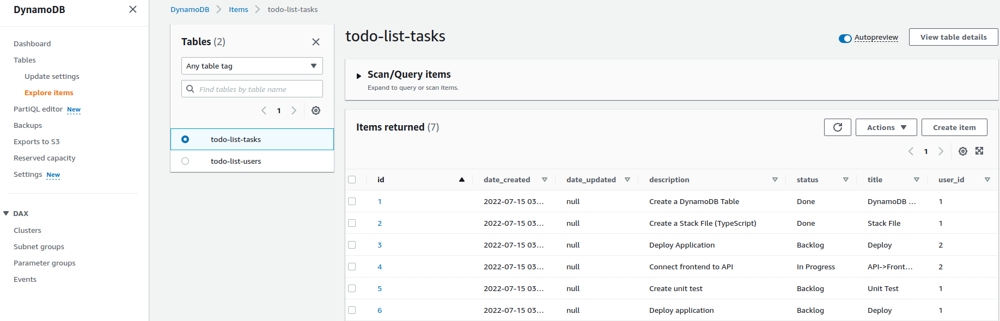

# AWS DynamoDB

### todo-list-tasks DynamoDB table

**DynamoDB** is a [NoSQL](https://aws.amazon.com/nosql/) key-value store. This means it doesn't store data in a structured, relational mapping; instead, it stores JSON objects in a simple key-value format. DynamoDB is fast, scalable, robust, and flexible in implementation. It doesn't use SQL. It works for simple *key/value* data, large document storage, and everything in between.

Each table contains a set of items, and each item has a set of fields or attributes. Each table must have a primary key, present in all times within the table, and this primary key can be either a single attribute or a combination of two attributes: a *partition key* and a *sort key*.

Amazon DynamoDB is not ideal for following situations:
* Traditional RDS apps
* Joins and/or complex transactions
* BLOB data
* Large data with low I/O rate

## Tables, Items, and Attributes
A **table** is a grouping of data records. For example, you might have a Users table to store data about your users, and an Orders table to store data about your user's orders. This concept is similar to a table in a relational database or a collection in MongoDB.

An **item** is a single data record in a table. Each item in a table is uniquely identified by the stated *primary key* of the table. In your Users table, an item would be a particular User. An item is similar to a row in a relational database or a document in MongoDB.

**Attributes** are pieces of data attached to a single item. This could be a simple Age attribute that stores the age of a user. An attribute is comparable to a column in a relational database or a field in MongoDB. DynamoDB does not require attributes on items except for attributes that make up your primary key.

## What is a partition key?
* **Partition key**
   * A simple *primary key*, composed of one attribute known as the *partition key*. Attributes in DynamoDB are similar in many ways to fields or columns in other database systems.
* **Partition key and Sort key**
   * Referred to as a *composite primary key*, this type of key is composed of two attributes. The first attribute is the *partition key*, and the second attribute is the *sort key*. All data under partition key is sorted by the sort key value.

## Primary key
There are two types of primary key: a **simple primary key** made up of just a partition key, and a **composite primary key** made up of a partition key and a sort key.

Using a **simple primary key** is similar to standard key-value stores like Memcached or accessing rows in a SQL table by a primary key. One example would be a Users with a Username primary key.

The **composite primary key** is more complex. With a composite primary key, you specify both a partition key and a sort key. The sort key is used to *sort* items with the same partition. One example could be an Orders table for recording customer orders on an e-commerce site. They partition key would be the CustomerId, and the sort key would be the OrderId.

## Reference
* [Amazon DynamoDB](https://digitalcloud.training/amazon-dynamodb/)
* [Standout AWS Services](https://medium.com/serverlessguru/standout-aws-services-b80498e58f03)
* [DynamoDB Key Concepts](https://www.dynamodbguide.com/key-concepts)
* [What is a partition key?](https://aws.amazon.com/blogs/database/choosing-the-right-dynamodb-partition-key/)
* [Amazon DynamoDB and Serverless](https://www.serverless.com/guides/dynamodb)
* [AWS DynamoDB — A Serverless NoSQL Database](https://medium.com/serverlessguru/aws-dynamodb-a-serverless-nosql-database-706c0f3952bc)