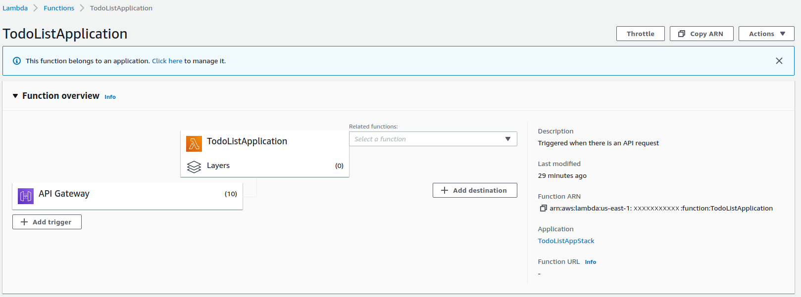
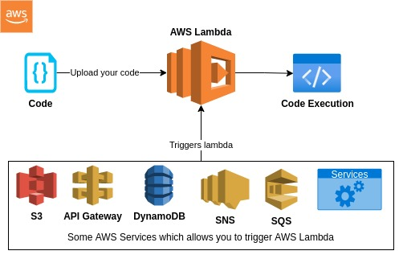
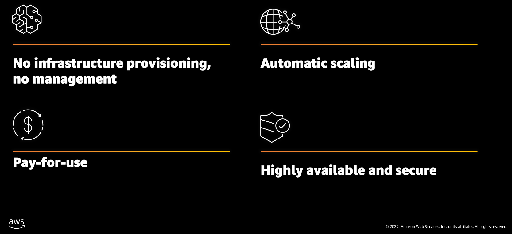

# AWS Lambda

### TodoListApplication Lambda function

**[AWS Lambda](https://aws.amazon.com/lambda/)** is an event-driven, *[serverless](https://www.redhat.com/en/topics/cloud-native-apps/what-is-serverless)* computing service provided by Amazon Web Services (AWS). Users of AWS Lambda create functions, self-contained applications written in one of the supported languages and runtimes, and upload them to AWS Lambda, which executes those functions in an efficient and flexible manner. AWS Lambda function helps you to focus on your core product and business logic instead of managing operating system (OS) access control, OS patching, right-sizing, provisioning, scaling, etc.

Benefits of AWS Lambda:
* No servers to manage
* Continuous scaling
* Millisecond billing
* Integrates with almost all other AWS services

Primary use cases for AWS Lambda:
* Data processing
* Real-time file processing
* Real-time stream processing
* Build serverless backends for web, mobile, IOT, and 3rd party API requests

## How does Lambda work?

**Step 1**: Upload your AWS Lambda code in any language that are supported by AWS Lambda function.
* Go
* C#
* Java
* Python
* Node.js
* .NET Core

**Step 2**: If the Lambda is triggred by these some AWS services, it will execute the uploaded code on your AWS Lambda function.

**Step 3**: AWS charges only when the AWS Lambda code executes, and not otherwise.

## Event that tigger AWS Lambda
Here are some events that trigger AWS Lambda:
* Entry into an S3 Object
* A queue coming from SQS
* Notifications sent from SNS
* Insert, updating or deleting data on DynamoDB Table
* A DynamoDB can trigger AWS Lambda whenever there is data added, modified, and deleted in the table
* API Gateway allows you to trigger AWS Lambda on GET/POST/DELETE/PUT methods

## What does serverless mean?

## Reference
* [What is AWS Lambda?](https://www.serverless.com/aws-lambda)
* [AWS Compute Services](https://digitalcloud.training/aws-compute-services/#aws-lambda)
* [What is AWS Lambda? Lambda Function with Examples](https://www.guru99.com/aws-lambda-function.html)