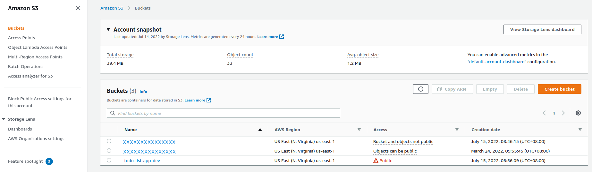
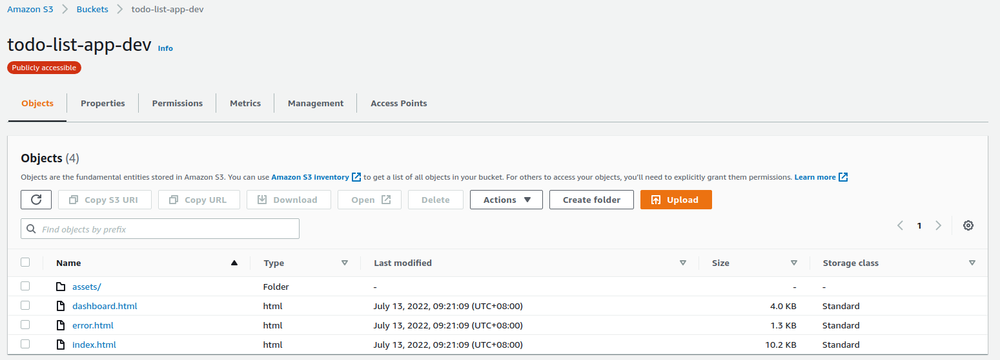

# AWS S3 (Simple Storage Service)

### Amazon S3 Buckets

**[AWS S3's](https://docs.aws.amazon.com/AmazonS3/latest/userguide/Welcome.html)** primary purpose is to store all kinds of files in the cloud, from media files to static web pages, and to make them available via simple requests, either from inside your application or directly out to your customers. Amazon S3 is a managed service, which means all you have to do is upload and download the files you need. Apart from data storage functionality, the AWS S3 bucket provides a remarkable feature of static website hosting over it. A website that doesn't involve server-side communication is called a *static website*.

Typical use cases include:
* **Backup and Storage**: Provide data backup and storage services for others
* **Application Hosting**: Provide services that deploy, install, and manage web applications
* **Media Hosting**: Build a redundant, scalable, and highly available infrastructure that hosts video, photo, or music uploads and downloads
* **Static Website**: You can configure a static website to run from an S3 bucket

## Buckets and Objects
An **object** consists of data, key (assigned name), and metadata. A **bucket** is used to store objects. When data is added to a bucket, Amazon S3 creates a unique version ID and allocates it to the object.

Bucket names must follow a set of rules:
* Names must be unique across all of AWS
* Names must be 3 to 63 characters in length
* Names can only contain lowercase letters, numbers, and hyphens
* Names cannot be formatted as an IP address

Object consist of:
* **Key**: name of the object
* **Value**: data made up of a sequence of bytes
* **Version ID**: used for versioning
* **Metadata**: data about the data that is stored

## Types of S3 Object Metadata

### System-defined object metadata
For each object stored in a bucket, Amazon S3 maintains a set of system metadata. System metadata has 2 categories:
1. **Metadata**: Like object  creation date which is controlled by the system and solely Amazon S3 has the ability to update its value.
2. **Other system metadata**: Like the storage class configured for an object and objects of enabled server-side encryption, are system metadata with values controlled by you.

Upon the creation of objects, the following may be done: configuring values of system metadata items, and updating values when necessary.

### User-defined object metadata
When uploading an object, you can also assign metadata to the object. You provide this optional information as a name-value (key-value) pair when you send a *PUT* or *POST* request to create the object. When you upload objects using the REST API, the original user-defined metadata names must begin with `x-amz-meta-` to distinguish them from other HTTP headers. Retrieving an object through the REST API, this prefix is returned but the prefix is not needed when uploading it through SOAP API. When you upload objects using the SOAP API, the prefix is not required. When you  retrieve the object using the SOAP API, the prefix is removed, regardless of which API you used to upload the object. Metadata with unprintable characters are not returned, but the `x-amz-missing-meta` header returns showing the value of unprintable metadata.

---
**NOTE**

SOAP support over HTTP is deprecated, but it is still available over HTTPS. New Amazon S3 features will not be supported for SOAP. We recommend that you use either the REST API or the AWS SDKs.

---

User-defined Metadata:
* Set of key-value pairs
* Stored by Amazon S3 in lowercase
* Key-value pairs need to be compliant with:
  * US-ASCII when using REST
  * UTF-8 when using both SOAP or browser-based uploads through *POST*

## Reference
* [AWS Storage Services](https://digitalcloud.training/aws-storage-services/)
* [Working with object metadata](https://docs.aws.amazon.com/AmazonS3/latest/userguide/UsingMetadata.html)
* [Amazon S3 - The Ultimate Guide](https://www.serverless.com/guides/amazon-s3)
* [AWS S3 Object Key and Metadata](https://www.cloudysave.com/aws/s3/s3-object-key-and-metadata/)
* [What is AWS S3: Overview, Features and Storage Classes Explained](https://www.simplilearn.com/tutorials/aws-tutorial/aws-s3)