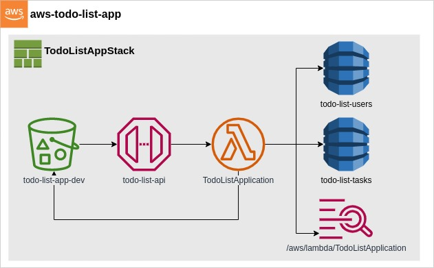

# AWS Cloud Based Todo List



The AWS Cloud Based Todo List Web App contains the following:
* [Lambda](AWS_Lambda.md)
* [DynamoDB](AWS_DynamoDB.md)
* [S3 Bucket](AWS_S3Bucket.md)
* [API Gateway](AWS_APIGateway.md)
* [Code Pipeline](AWS_CodePipeline.md)

The **Lambda** function will run our code in response to events and automatically manages the underlying compute resources. It will handle every request coming from the API gateway and will return a response from the API gateway. The `TodoListFunction` lambda function has an access to the DynamoDB of `users` and `tasks` table for reading and writing permission.

**DynamoDB** will serve as our database to store our data for users and tasks. Both `users` and `tasks` table has a partition key called `id`. The partition key is our primary key for the said table.

The **S3 Bucket** is for the frontend where it is going to be deployed as a static web application. It is a container for our static files and is the source code for our frontend.

An **API Gateway** will route all requests to the lambda function and is configured with [CORS](https://developer.mozilla.org/en-US/docs/Web/HTTP/CORS). It has an API endpoint for `tasks` and `users`. The `tasks` endpoint has a method of *GET* and *POST*. It also has a resource where it accepts a `task_id` with the method of *POST* and *DELETE*. Whilst the `users` endpoint has the same structure as `tasks` but it accepts the `user_id` path parameter.

Lastly, **Code Pipeline** is used for the automation of the software deployment process ([CI/CD](https://www.redhat.com/en/topics/devops/what-is-ci-cd)). It automatically builds, tests, and launches the application each time there is a change in our code. Code Pipeline is integrated with a third-party service called Github. When the developer commit changes to the repository, Code Pipeline automatically detects the changes. Those changes are built, and if there are tests that are configured, they will run. After the tests are complete, the code is built and deployed to the staging. The pipeline setup we have has the developer stage and the production stage, where it needs to be manually approved to be deployed.

## File Hierarchy
```
aws-todo-list-app
│
└───bin
│   │
│   └───todo-list.ts
|
└───cmd
│   │
│   └───todoList
│     │
│     └───main.go
│   
└───lib
│   │
│   └───stacks
│   │ │
│   │ └───todo-list-stack.ts
│   │
│   └───stage
│   │ │
│   │ └───todo-list-stage.ts
│   │
│   └───pipeline-stack.ts
│   
└───pkg
│   
└───web_app
│   
└───.gitignore
│   
└───.npmignore
│   
└───cdk.json
│   
└───go.mod
│   
└───go.sum
│   
└───jest.config.js
│   
└───.gitignore
│   
└───package-lock.json
│   
└───package.json
│   
└───tsconfig.json
```

## Project Directory
* `cmd/todoList/main.go` is our lambda handler where our function code processes the API events.
* `lib/stacks/todo-list-stack.ts` is where your CDK application’s main stack is defined.
* `lib/stage/todo-list-stage.ts` is where you instantiate your resource stack.
* `lib/pipeline-stack.ts` is the initial structure of your pipeline and instantiating the `developer` and `production` stage.
* `bin/todo-list.ts` is the entrypoint of the CDK application. It will load the stack defined in `lib/todo-list-stack.ts`.
* `web_app` contains our front-end design for Todo List App that will be placed in an S3 bucket called `todo-list-app-dev`. It has a functionality of create, read, update, and delete for `users` and `tasks`.
* `package.json` is your npm module manifest. It includes information like the name of your app, version, dependencies and build scripts like “watch” and “build” (package-lock.json is maintained by npm)
* `cdk.json` tells the toolkit how to run your app. In our case it will be "npx ts-node bin/todo-list.ts"
* `tsconfig.json` your project’s typescript configuration
* `.gitignore` and `.npmignore` tell git and npm which files to include/exclude from source control and when publishing this module to the package manager.
* `node_modules` is maintained by npm and includes all your project’s dependencies.

## AWS Configure
Configure your workstation with your credentials and an AWS region.
```bash
dev@dev:~$ aws configure
```

To create multiple accounts for AWS CLI:
```bash
dev@dev:~$ aws configure --profile profile_name
```

Provide your AWS access key ID, secret access key and default region when prompted. You can switch between the accounts by passing the profile on the command.

```bash
dev@dev:~$ aws s3 ls --profile profile_name
```

When no `--profile` parameter in the command, `default` profile will be used.

## Synthesis
Program synthesis is the process of finding a program in the underlying programming language that meets the user's specification in way that satisfies their needs. Programming Synthesis means dealing with the aspects of the software development process which can, at least in principle, be automated. Its goal is to mechanically synthesize correct and efficient computer code from declarative specifications.

```bash
dev@dev:~:aws-todo-list-app$ cdk synth
Resources:
  TodoListcustomRole78A60DC9:
    Type: AWS::IAM::Role
    Properties:
      AssumeRolePolicyDocument:
        Statement:
          - Action: sts:AssumeRole
            Effect: Allow
            Principal:
              Service: lambda.amazonaws.com
        Version: "2012-10-17"
      ManagedPolicyArns:
        - Fn::Join:
            - ""
            - - "arn:"
              - Ref: AWS::Partition
              - :iam::aws:policy/service-role/AWSLambdaBasicExecutionRole
      RoleName: TodoList_customRole
    Metadata:
      aws:cdk:path: TodoListAppStack/TodoList_customRole/Resource
.....
Parameters:
  BootstrapVersion:
    Type: AWS::SSM::Parameter::Value<String>
    Default: /cdk-bootstrap/zep458faq/version
    Description: Version of the CDK Bootstrap resources in this environment, automatically retrieved from SSM Parameter Store. [cdk:skip]
Rules:
  CheckBootstrapVersion:
    Assertions:
      - Assert:
          Fn::Not:
            - Fn::Contains:
                - - "1"
                  - "2"
                  - "3"
                  - "4"
                  - "5"
                - Ref: BootstrapVersion
        AssertDescription: CDK bootstrap stack version 6 required. Please run 'cdk bootstrap' with a recent version of the CDK CLI.
```

## Bootstrapping
Bootstrapping is a process in which simple language is used to translate more complicated program which in turn may handle for more complicated program. Bootstrapping is the process of loading a set of instructions when a computer is first turned on or booted. During the startup process, diagnostic tests are performed, such as the power-on self-test (POST), that set or check configurations for devices and implement routine testing for the connection of peripherals, hardware and external memory devices. The bootloader or bootstrap program is then loaded to initialize the OS.

Typical programs that load the OS are:
* GNU Grand Unified Bootloader (GRUB)
* NT Loader (NTLDR)
* Linux Loader (LILO)
* Network Interface Controller (NIC)

```bash
dev@dev:~:aws-todo-list-app$ cdk bootstrap --profile profile_name
  ⏳  Bootstrapping environment aws://xxxxxxxxxx/xx-xxxx-x...
Trusted accounts for deployment: (none)
Trusted accounts for lookup: (none)
Using default execution policy of 'arn:aws:iam::aws:policy/AdministratorAccess'. Pass '--cloudformation-execution-policies' to customize.
CDKToolkit: creating CloudFormation changeset...

 ✅  Environment aws://xxxxxxxxxx/xx-xxxx-x bootstrapped.
****************************************************
*** Newer version of CDK is available [2.31.1]   ***
*** Upgrade recommended (npm install -g aws-cdk) ***
****************************************************
```

### Updgrade CDK
```bash
dev@dev:~:aws-todo-list-app$ npm install -g aws-cdk
added 1 package, and audited 2 packages in 1s

found 0 vulnerabilities
npm notice 
npm notice New minor version of npm available! 8.5.0 -> 8.13.2
npm notice Changelog: https://github.com/npm/cli/releases/tag/v8.13.2
npm notice Run npm install -g npm@8.13.2 to update!
npm notice 
```

## Deploy
This is to deploy your CDK app. You should see a warning asking if `Do you wish to deploy these changes (y/n)?`. This is warning you that deploying the app contains security-sensitive changes. Since we need to allow/deny the resources, enter `y` to deploy the stack and create the resources.

```bash
dev@dev:~$ cdk deploy --profile profile_name
✨  Synthesis time: 3.89s

This deployment will make potentially sensitive changes according to your current security approval level (--require-approval broadening).
Please confirm you intend to make the following modifications:

IAM Statement Changes
┌───┬──────────────────────────────────────────────┬────────┬──────────────────────────────────────────────┬──────────────────────────────────────────────┬────────────────────────────────────────────────┐
│   │ Resource                                     │ Effect │ Action                                       │ Principal                                    │ Condition                                      │
├───┼──────────────────────────────────────────────┼────────┼──────────────────────────────────────────────┼──────────────────────────────────────────────┼────────────────────────────────────────────────┤
│ + │ ${Custom::CDKBucketDeployment9351AE39958944B │ Allow  │ sts:AssumeRole                               │ Service:lambda.amazonaws.com                 │                                                │
│   │ 45CED0CD9AC6950C/ServiceRole.Arn}            │        │                                              │                                              │                                                │
├───┼──────────────────────────────────────────────┼────────┼──────────────────────────────────────────────┼──────────────────────────────────────────────┼────────────────────────────────────────────────┤
│ + │ ${Custom::S3AutoDeleteObjectsCustomResourceP │ Allow  │ sts:AssumeRole                               │ Service:lambda.amazonaws.com                 │                                                │
│   │ rovider/Role.Arn}                            │        │                                              │                                              │                                                │
├───┼──────────────────────────────────────────────┼────────┼──────────────────────────────────────────────┼──────────────────────────────────────────────┼────────────────────────────────────────────────┤

...........

(NOTE: There may be security-related changes not in this list. See https://github.com/aws/aws-cdk/issues/1299)

Do you wish to deploy these changes (y/n)? 
```

The output shoukd look like the this:
```bash
TodoListAppStack: deploying...
[0%] start: Publishing xxxxxxxxxxxxxxxxxxxxxxxxxxxxxxxxxxxxxxxxxxxxxxxxxxxxxxxxxxxxxxxx:current_account-current_region
[100%] success: Published xxxxxxxxxxxxxxxxxxxxxxxxxxxxxxxxxxxxxxxxxxxxxxxxxxxxxxxxxxxxxxxx:current_account-current_region
TodoListAppStack: creating CloudFormation changeset...

 ✅  TodoListAppStack

✨  Deployment time: 106.99s

Stack ARN:
arn:aws:cloudformation:xx-xxxx-x:xxxxxxxxxx:stack/TodoListAppStack/xxxxxxxxxxxxxxxxxxxxxxxxx

✨  Total time: 110.66s
```

## Install aws-todo-list-app
Run `npm install` in the root of your project and this will install all the dependencies.

```bash
dev@dev:~:aws-todo-list-app$ npm install
up to date, audited 537 packages in 964ms

27 packages are looking for funding
  run `npm fund` for details

found 0 vulnerabilities
```

## Reference
* [Bootstrap](https://www.techopedia.com/definition/3328/bootstrap)
* [AWS CDK v2](https://docs.aws.amazon.com/cdk/api/v2/)
* [TypeScript Workshop](https://cdkworkshop.com/20-typescript.html)
* [CORS on API Gateway](https://enable-cors.org/server_awsapigateway.html)
* [What is Bootstrapping?](https://www.youtube.com/watch?v=nslY1s0U9_c)
* [AWS SDK for Go API Reference](https://docs.aws.amazon.com/sdk-for-go/api/)
* [Getting started with the AWS CDK](https://docs.aws.amazon.com/cdk/v2/guide/getting_started.html)