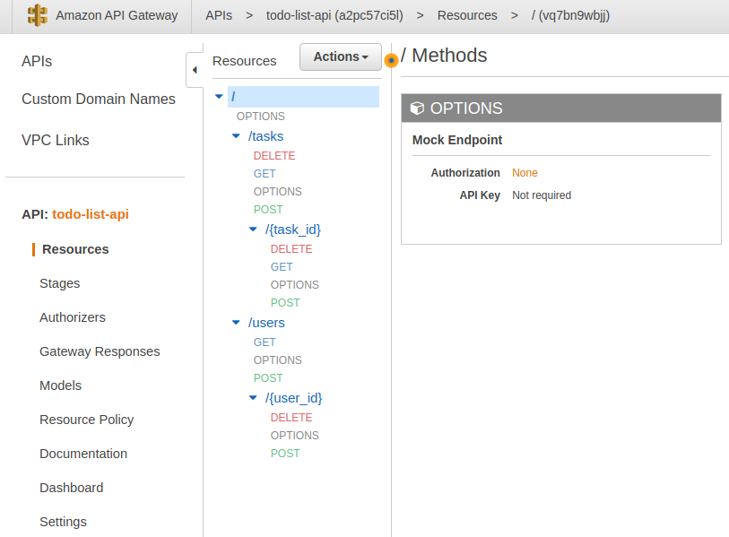

# AWS API Gateway

### todo-list-api



**[Amazon API Gateway](https://docs.aws.amazon.com/apigateway/latest/developerguide/welcome.html)** is a managed service that allows developers to define the HTTP endpoints of a REST API or a WebSocket API and connect endpoints with the corresponding backend business logic. It also handles authentication, access control, monitoring, and tracing of API requests.

An **API endpoint** type is a hostname for an API in API Gateway that is deployed to a specific region. The hostname is of the form `{api-id}.execute.api.{region}.amazonaws.com`. The API endpoint type can be edge-optimized, regional, or private, depending on where most of your API traffic originates from.

## REST API
* A collection of HTTP resuorces and methods that are integrated with backend HTTP endpoints, Lambda functions, or other AWS services.
* This collection can be deployed in one or more stages.
* Typically, API resources are organized in a resource tree according to the application logic.
* Each API resource can expose one or more API methods that have unique HTTP verbs supported by API Gateway.

## WebSocket API
* A collection of WebSocket routes and route keys that are integrated with backend HTTP endpoints, Lambda functions, or other AWS services.
* The collection can be deployed in one or more stages.
* API Methods are invoked through frontend WebSocket connections that you associate with a registered domain name.

## Usage Plans and API Keys
A **usage plan** specifies who can access one or more deployed API stages and methods — and how much and how fast they can access them. The plan uses API keys to identify API clients and meters access to the associated API stages for each key.

**API Keys** are alphanumeric string values that you distribute to app develoepr customers to grant access to your API. You can use API keys together with usage plans or Lambda authorizers to control access to your APIs.

## Cross-origin resource sharing (CORS)
[CORS](https://developer.mozilla.org/en-US/docs/Web/HTTP/CORS) is one way that the server at the other end (not the client code in the browser) can relax the same-origin-policy. CORS allows restricted resources (e.g. fonts) on a web page to be requested from another outside domain from which the first resource was shared.

Using CORS:
* Can enable CORS on API Gateway is using JavaScript/AJAX
* Can be used to enable requests from domains other than the APIs domain
* Allows the sharing of resources between different domains
* The method (GET, PUT, POST, etc.) for which you will enable CORS must be available in the API Gateway API before you enable CORS
* If CORS is not enabled and an API resource received requests from another domain the request will be blocked
* Enable CORS on the API resources using the selected methods under the API Gateway

## Enable CORS
1. Create all the REST resources that needs to be exposed with their methods before setting up CORS (if new resources/methods are created after enabling CORS, these steps must be repeated)
2. Select a resource. Add **OPTIONS** method, choose **Mock** as integration type
3. For each Method of a resource, go to **Response Method** and add all the response method that should be supported (i.e. 200, 400, 500, etc.)
4. For each response code, set the *Response Headers* to:
   * X-Requested-With
   * Access-Control-Allow-Headers
   * Access-Control-Allow-Origin
   * Access-Control-Allow-Methods
5. Go to **Integration Response**, select one of the created response codes, then Header Mappings, insert default values for headers. This operation has to be repeated for each method, including the newly created OPTIONS
   Example:
   ```
   Access-Control-Allow-Origin: '*'
   Access-Control-Allow-Headers: 'Content-Type,X-Amz-Date,Authorization,X-Api-Key,x-requested-with'
   Access-Control-Allow-Methods: 'POST,GET,OPTIONS'
   ```
6. Deploy the API to a stage.

## Reference
* [Amazon API Gateway](https://www.serverless.com/guides/amazon-api-gateway)
* [Amazon API Gateway](https://digitalcloud.training/amazon-api-gateway/)
* [CORS on AWS API Gateway](https://enable-cors.org/server_awsapigateway.html)
* [HTTP API (API Gateway v2)](https://www.serverless.com/framework/docs/providers/aws/events/http-api)
* [REST API (API Gateway v1)](https://www.serverless.com/framework/docs/providers/aws/events/apigateway#lambda-proxy-integration)