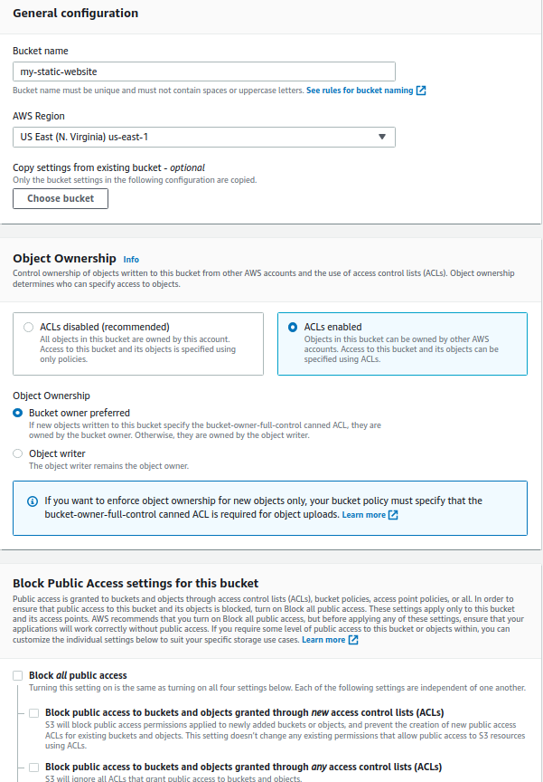
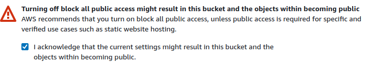
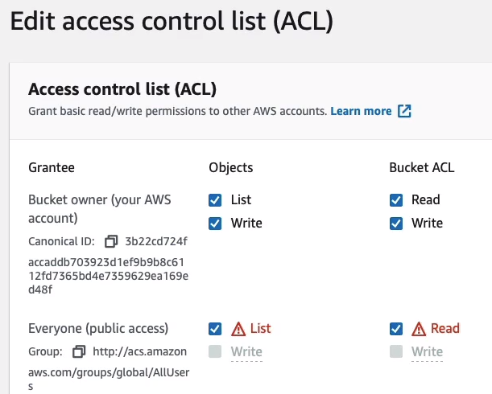
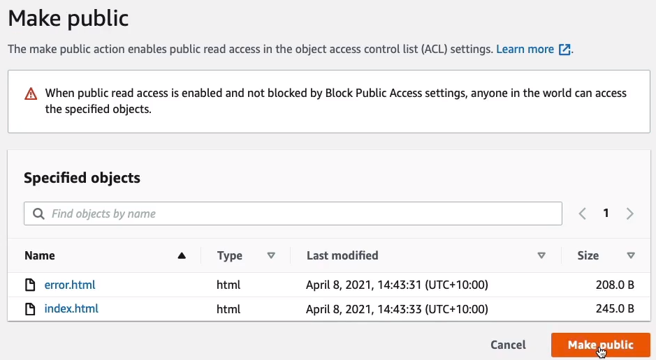
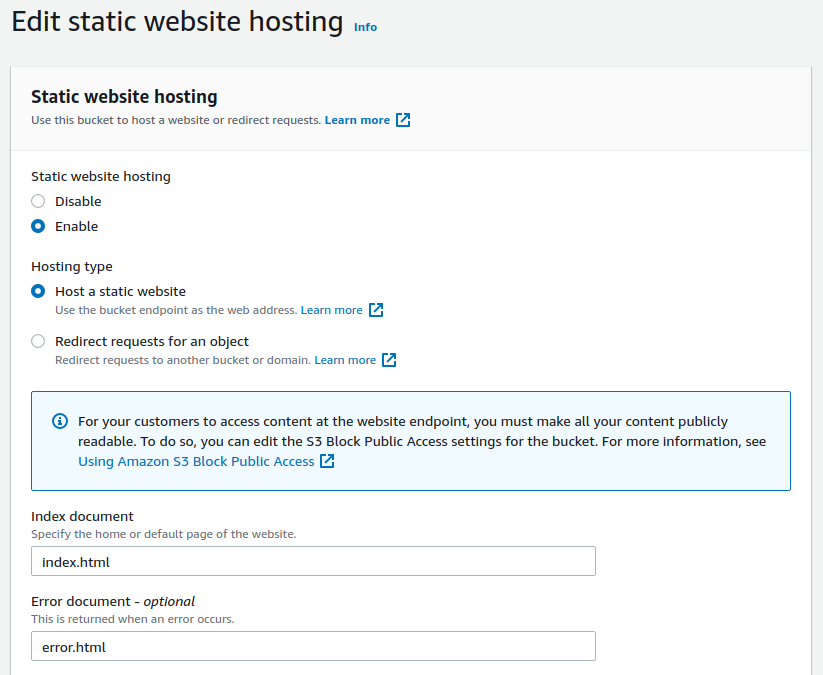
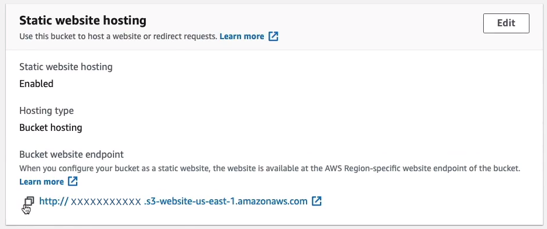

## S3 Static Website Hosting
In Amazon Management Console, you can go to the *Services* and look for *Storage* and click on **S3**. You can click on **Create bucket** on the top right side and enter the bucket name, in what AWS Region you want to deploy your static website, and disable the **Block all public access** for it to be publicly accessible.



After configuring the public access settings, make sure to check the box to acknowledge it.



Go to the **Permissions** tab inside *my-static-website* bucket and scroll down. Under **Access Control List (ACL)**, enable the *List* and *Read*  for **Everyone**.



Create 2 HTML files namely, `index.html` and `error.html`. After you're done creating it, upload both of them to your S3 bucket on **Objects** tab.

##### index.html
```html
<html>
<head>
<style>
body {
  background-color: #33342D;
}
h1 { color: white; }
h1 {
 text-align:center
}
</style>
</head>
<body>
<h1>Congratulations, you've launched a static website on Amazon S3</h1>

</body>
</html>
```

##### error.html
```html
<html>
<head>
<style>
body {
  background-color: #33342D;
}
h1 { color: white; }
h1 {
 text-align:center
}
</style>
</head>
<body>

<h1>Error: this is an error page generated on Amazon S3</h1>
</body>
</html>
```

To make it fully publicly accessible, click on **Actions** and scroll down to the bottom and you'll find **Make public using ACL**.



Now that it is publicly accessible, go to the **Properties** tab and scroll down to the bottom of the page and you'll find **Static website hosting**. On the right, click on *Edit* then *Enable* and we are going to *Host a static website*. We have to put in the name of our files and then we can simply save the changes.



If you scroll down to the bottom, you can now see that there is a URL and that's the URL for your static website.

