# Setup CDK Pipeline

### Pre-requisites
* Node.js
* TypeScript
* AWS Account
* AWS CDK installed
* AWS CLI installed and configured

## Setup CodeStar Connection
Open the AWS CodePipeline Console and go to the **Connections** page from the **Settings** dropdown in the left hand menu. Click **Create Connection**.

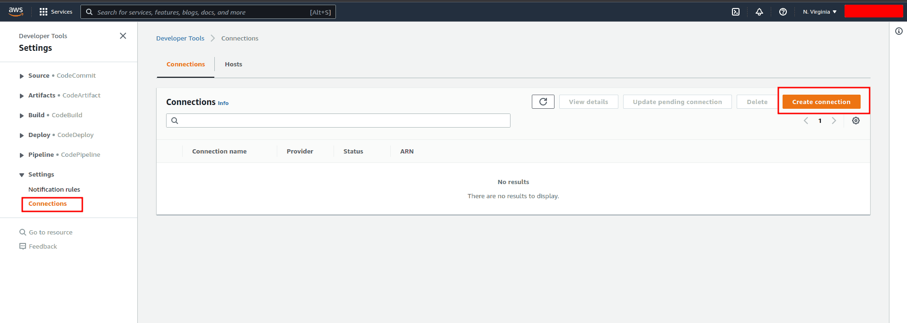

Select the **Github** provider, give the connection a name, and hit **Connect to Github**.

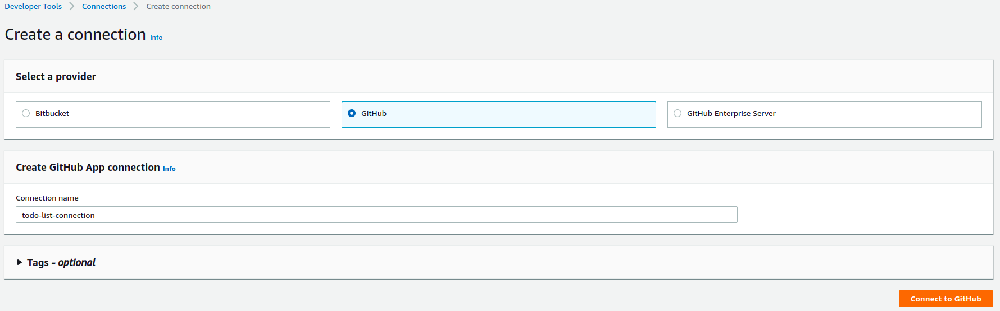

On the next page, choose to **Install a new app**.

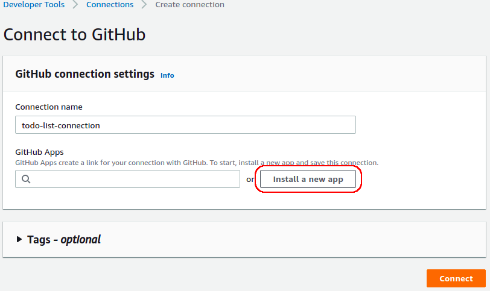

Sign in with Github, select the repository the connector is to be used for, and click **Install**.

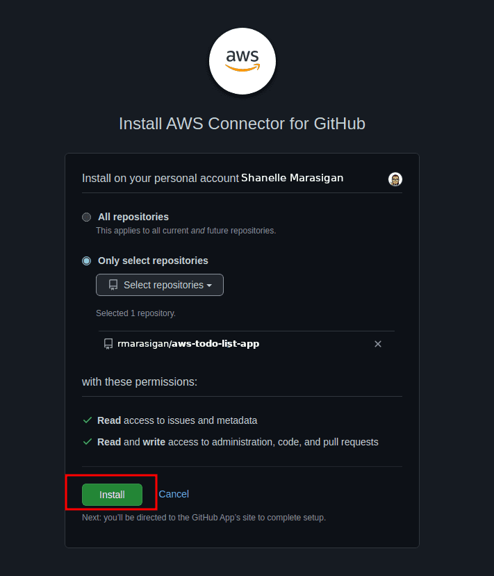

Once back on the AWS Console, make sure the newly installed app is selected and click **Connect**.

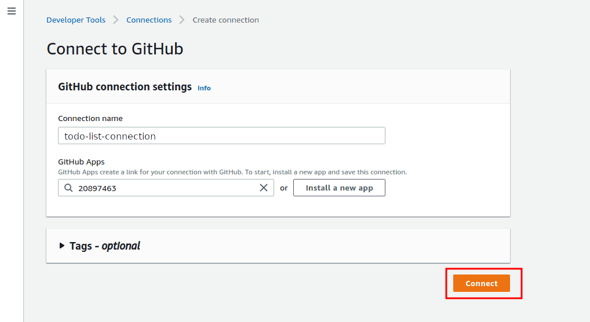

## CDK Project Setup
Create a new file inside `/lib` directory called **`pipeline-stack.ts`**. In here we are going to use the `CodePipelineSource.connection()` method to specify the CodeStar connection we created.

```typescript
import * as cdk from 'aws-cdk-lib';
import { Construct } from 'constructs';
import { CodeBuildStep, CodePipeline, CodePipelineSource } from 'aws-cdk-lib/pipelines';

export class AppNamePipelineStack extends cdk.Stack
{
   constructor(scope: Construct, id: string, props?: cdk.StackProps)
   {
      super(scope, id, props);

      const repo_branch = 'master';
      const repo = 'username/repostory-name';
      const codeStartArn = 'arn:aws:codestar-connections:xx-xxxx-x:xxxxxxxxxxxx:connection/xxxxxxxx-xxxx-xxxx-xxxx-xxxxxxxxxxxx';
      const source = CodePipelineSource.connection(repo, repo_branch, { connectionArn: codeStartArn });

      // Sets the initial structure of our pipeline
      const AppNamePipeline = new CodePipeline(this, 'AppNamePipeline',
      {
         pipelineName: 'AppNamePipeline',
         synth: new CodeBuildStep('SynthStep',
         {
            input: source,
            installCommands: ["npm install -g aws-cdk"],
            commands: ['npm ci', 'npm run build', 'npx cdk synth']
         })
      });
   }
}
```

Next step is to make sure that this `pipeline-stack` will serve as the entry point for our CDK project and the resources defined within. So we need to update the **`/bin/app-name.ts`** file.
```typescript
#!/usr/bin/env node
import 'source-map-support/register';
import * as cdk from 'aws-cdk-lib';

// Import the newly created pipeline stack
import { AppNamePipelineStack } from '../lib/pipeline-stack';

const app = new cdk.App();

// Instantiate the pipeline stack
new AppNamePipelineStack(app, 'AppNameStack');
```

Now that the entry point has been updated, we need a way to connect the resource stack(s) (which contains the actual AWS resources to be deployed) to the pipeline stack. For this, we will create a new CDK Stage and add it to the pipeline stack. Create a new file in `/lib/stage` called **`app-name-stage.ts`**.
```typescript
import { Construct } from 'constructs';
import { Stage, StageProps } from 'aws-cdk-lib';

export class AppNamePipelineStage extends Stage
{
   constructor(scope: Construct, id: string, props: AppNameProps)
   {
      super(scope, id);
   }
}
```

Once the `app-name-stage.ts` is created, update the `lib/pipeline-stack.ts` and add the stage to the pipeline.
```typescript
import * as cdk from 'aws-cdk-lib';
import { Construct } from 'constructs';
import { CodeBuildStep, CodePipeline, CodePipelineSource } from 'aws-cdk-lib/pipelines';
import { AppNamePipelineStage } from './stage/app-name-stage';

export class AppNamePipelineStack extends cdk.Stack
{
   constructor(scope: Construct, id: string, props?: cdk.StackProps)
   {
      super(scope, id, props);

      const repo_branch = 'master';
      const repo = 'username/repostory-name';
      const codeStartArn = 'arn:aws:codestar-connections:xx-xxxx-x:xxxxxxxxxxxx:connection/xxxxxxxx-xxxx-xxxx-xxxx-xxxxxxxxxxxx';
      const source = CodePipelineSource.connection(repo, repo_branch, { connectionArn: codeStartArn });

      // Sets the initial structure of our pipeline
      const AppNamePipeline = new CodePipeline(this, 'AppNamePipeline',
      {
         pipelineName: 'AppNamePipeline',
         synth: new CodeBuildStep('SynthStep',
         {
            input: source,
            installCommands: ["npm install -g aws-cdk"],
            commands: ['npm ci', 'npm run build', 'npx cdk synth']
         })
      });

      // Instantiate the stage and add it to the pipeline
      const developer = new AppNamePipelineStage(this, 'AppNameDeveloper',
      {
         deploymentStage: "developer"
      });
      AppNamePipeline.addStage(developer);

      const production = new AppNamePipelineStage(this, 'AppNameProduction',
      {
         deploymentStage: "production"
      });
      const preProduction = AppNamePipeline.addStage(production);
      preProduction.addPre(new ManualApprovalStep("manualApprovalActionProd"));
   }
}
```

Within our `lib/` directory, we will find that we have a default stack, which is where we will be defining our AWS resources. And the job of connecting this, and any other stacks we might have, to the pipeline stack is done by the pipeline stage. All we need to do is, instantiate our resource stack(s) within the pipeline stage.
```typescript
import { Construct } from 'constructs';
import { Stage, StageProps } from 'aws-cdk-lib';
import { AppNameStack } from '../stacks/app-name-stack';

export interface AppNameProps extends StageProps
{
   deploymentStage: string;
}

export class AppNamePipelineStage extends Stage
{
   constructor(scope: Construct, id: string, props: AppNameProps)
   {
      super(scope, id);
   }

   // Instantiate the resource stack
   new AppNameStack(this, 'AppNameStack',
   {
      deploymentStage: props.deploymentStage
   });
}
```

Our pipeline is ready. Next, commit and push the code to the `master` branch of the Github repo selected while setting up the CodeStar Connection.

## Deploy the Pipeline
For the very first deployment, we are required to directly deploy the stack using the CDK CLI. This will setup the pipeline for us to deploy the code pushed to the github repo.

Build the project:
```bash
dev@dev:~:app-name$ npm run build
```

Synthesise and deploy
```bash
dev@dev:~:app-name$ cdk synth && cdk deploy
```

Go to AWS CodePipeline console to verify that the pipeline has been successfully deployed.
##### TodoListAppPipeline

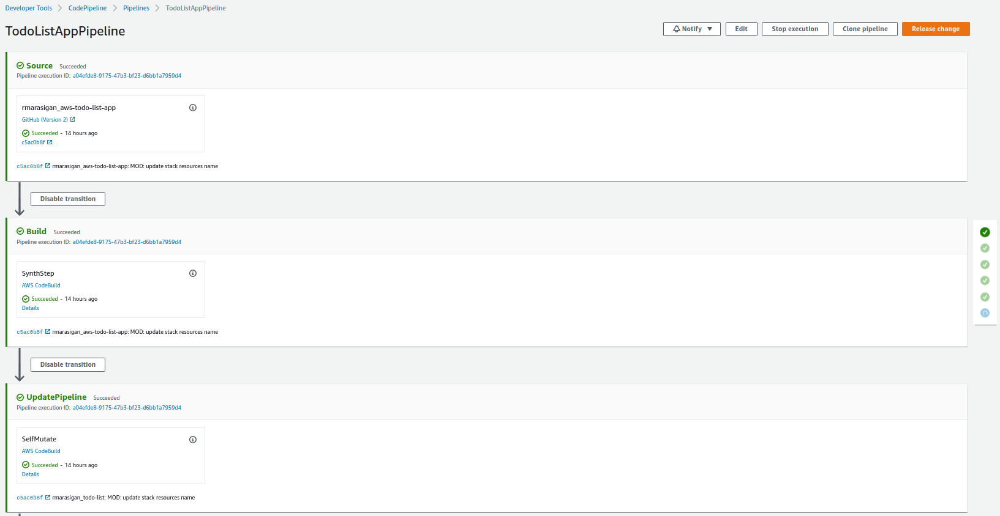

If you start pushing some changes, it will be deployed first on the `developer` stage.

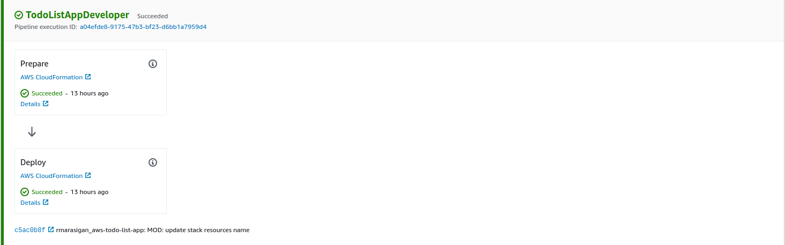

In order to roll out the changes to the `production` stage, you'll need to manually approve it. Click on **Review**.

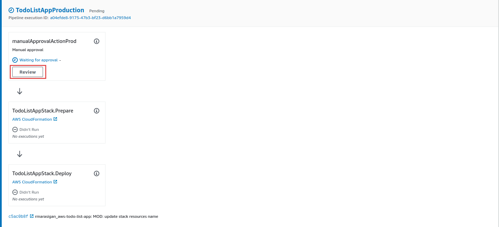

After hitting the **Review** button a small dialogue box will pop up, and click on **Approve** to roll out the changes on `production` stage. Deploying the stack to `production` stage sometimes might cause an error that says, "x resource already exists in stack". In order to fix this, delete the stack, and try to re-deploy it again.

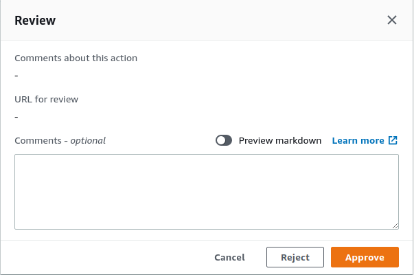

Being deployed on `production` stage, it will create the same resources that will look like this: `resource-name-developer` and `resource-name-production`.

#### DynamoDB
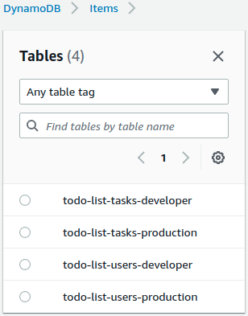

#### Lambda Function
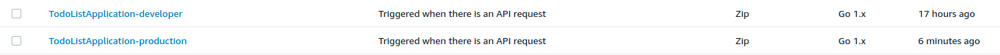

#### API Gateway
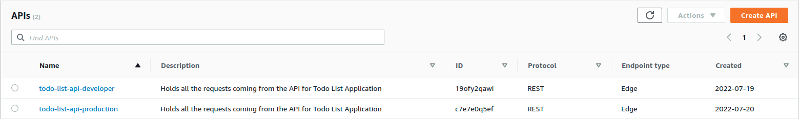

## Reference
* [Connections](https://docs.aws.amazon.com/dtconsole/latest/userguide/welcome-connections.html)
* [Creating CDK Pipelines with Github Source and CodeStar Connection](https://www.antstack.io/blog/cdk-pipelines-with-github-source-and-codestar-connection/)